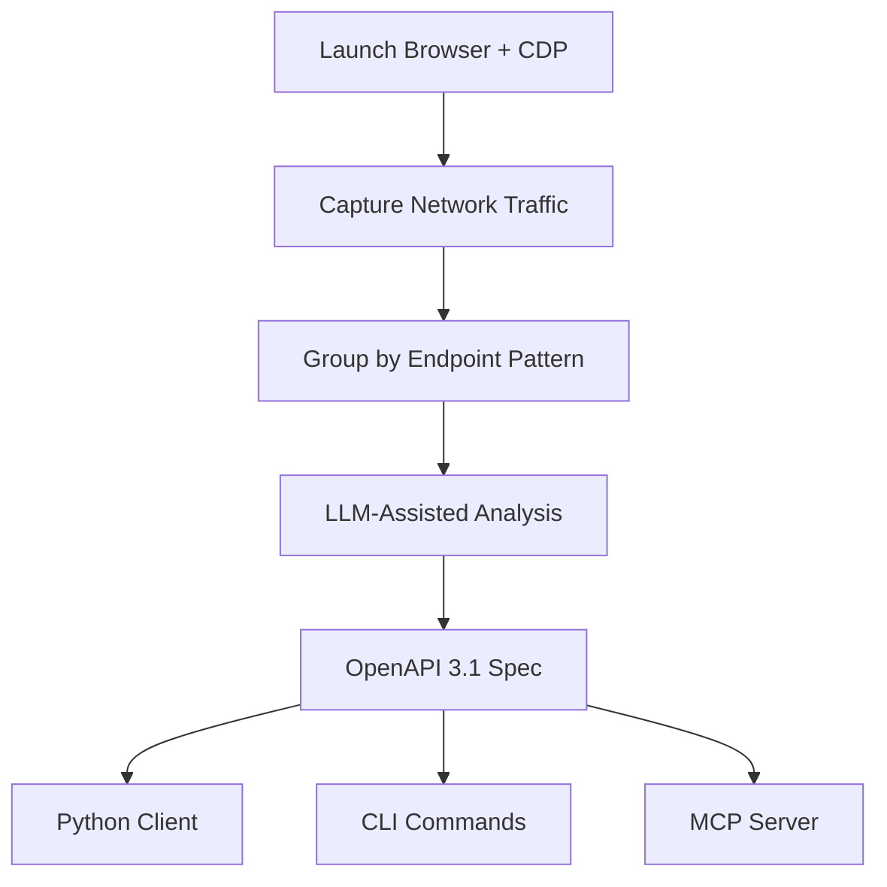
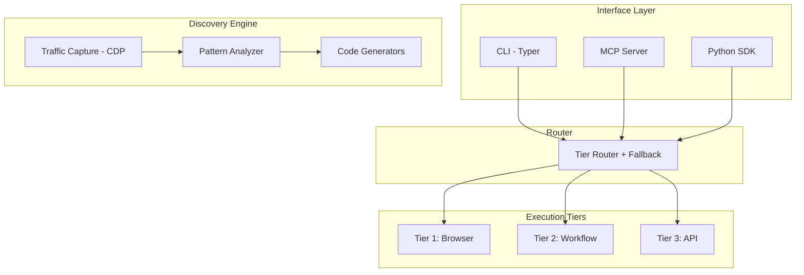

<p align="center">
  
</p>

<p align="center">
  <strong>Turn any website into a CLI/API for AI agents.</strong>
</p>

<p align="center">
  <a href="https://github.com/lonexreb/site2cli/actions/workflows/ci.yml"></a>
  <a href="https://pypi.org/project/site2cli/"></a>
  <a href="https://pypi.org/project/site2cli/"></a>
  <a href="LICENSE"></a>
  <a href="#testing"></a>
</p>

---

## The Problem

AI agents interact with websites through browser automation, which is slow, expensive, and unreliable:

| | Without site2cli | With site2cli |
|---|---|---|
| **Speed** | 10-30s per action (browser) | <1s per action (API) |
| **Cost** | Thousands of LLM tokens per page | Zero tokens for cached actions |
| **Reliability** | ~15-35% on benchmarks | >95% for discovered APIs |
| **Setup** | Write custom Playwright scripts | `site2cli discover <url>` |
| **Output** | Screenshots, raw HTML | Structured JSON, typed clients |

## How It Works

site2cli uses **Progressive Formalization** — a 3-tier system that automatically graduates interactions from slow-but-universal to fast-but-specific:


The **Discovery Pipeline** captures browser traffic and converts it into structured interfaces:



## Comparison

| Feature | browser-use | Hand-built CLIs | CLI-Anything | webctl | **site2cli** |
|---|---|---|---|---|---|
| Works on any site | Yes | No | Yes | Yes | Yes |
| Structured output | No | Yes | Yes | JSON/a11y/md | Yes |
| Auto-discovery | No | No | No | No | **Yes** |
| MCP server generation | No | No | No | No | **Yes** |
| Progressive optimization | No | N/A | No | No | **Yes** |
| Cookie banner handling | No | N/A | No | **Yes** | **Yes** |
| Auth page detection | No | N/A | No | **Yes** | **Yes** |
| Self-healing | No | No | No | No | **Yes** |
| No browser needed (after discovery) | No | Yes | No | No | **Yes** |
| Agent init/config | No | No | No | **Yes** | **Yes** |
| Community spec sharing | No | No | No | No | **Yes** |

## Quick Start

```bash
# Install (lightweight - no browser deps by default)
pip install site2cli

# Install with all features
pip install site2cli[all]

# Or pick what you need
pip install site2cli[browser]   # Playwright for traffic capture
pip install site2cli[llm]       # Claude API for smart analysis
pip install site2cli[mcp]       # MCP server generation
```

### Discover a Site's API

```bash
# Capture traffic and discover API endpoints
site2cli discover kayak.com --action "search flights"

# site2cli launches a browser, captures network traffic,
# and generates: OpenAPI spec + Python client + MCP tools
```

### Use the Generated Interface

```bash
# CLI
site2cli run kayak.com search_flights from=SFO to=JFK date=2025-04-01

# Or as MCP tools for AI agents
site2cli mcp generate kayak.com
site2cli mcp serve kayak.com
```

## As a Python Library

```python
from site2cli.discovery.analyzer import TrafficAnalyzer
from site2cli.discovery.spec_generator import generate_openapi_spec
from site2cli.generators.mcp_gen import generate_mcp_server_code

# Analyze captured traffic
analyzer = TrafficAnalyzer(exchanges)
endpoints = analyzer.extract_endpoints()

# Generate OpenAPI spec
spec = generate_openapi_spec(api)

# Generate MCP server
mcp_code = generate_mcp_server_code(site, spec)
```

## What Gets Generated

From a single discovery session, site2cli produces:

| Output | Description |
|---|---|
| **OpenAPI 3.1 Spec** | Full API specification with schemas, parameters, auth |
| **Python Client** | Typed httpx client with methods for each endpoint |
| **CLI Commands** | Typer commands you can run from terminal |
| **MCP Server** | Tools that AI agents (Claude, etc.) can call directly |

## Architecture



## Live Validation

site2cli has been validated with **7 experiments** across **15+ real public APIs** — a comprehensive pre-launch test suite:

### Experiment #8: Core Pipeline (5 APIs)

| API | Endpoints | Spec | Client | MCP | Pipeline |
|---|---|---|---|---|---|
| JSONPlaceholder | 8 | Valid | Makes real calls | 8 tools | 157ms |
| httpbin.org | 7 | Valid | Makes real calls | 7 tools | 179ms |
| Dog CEO API | 5 | Valid | Makes real calls | 5 tools | 209ms |
| Open-Meteo | 1 | Valid | Makes real calls | 1 tool | 686ms |
| GitHub API | 4 | Valid | Makes real calls | 4 tools | 323ms |
| **Total** | **25** | **5/5** | **5/5** | **25 tools** | **avg 310ms** |

### Experiment #9: API Breadth (10 APIs, 7 categories)

| API | Category | Endpoints | Spec | MCP Tools |
|---|---|---|---|---|
| PokeAPI | Structured REST | 5 | Valid | 5 |
| CatFacts | Simple REST | 3 | Valid | 3 |
| Chuck Norris | Simple REST | 3 | Valid | 3 |
| SWAPI (Star Wars) | Nested Paths | 5 | Valid | 5 |
| Open Library | Query Params | 2 | Valid | 2 |
| USGS Earthquake | Government/Science | 2 | Valid | 2 |
| NASA APOD | Government/Science | 1 | Valid | 1 |
| Met Museum | Cultural | 3 | Valid | 3 |
| Art Institute Chicago | Cultural | 4 | Valid | 4 |
| REST Countries | Geographic | 5 | Valid | 5 |
| **Total** | **7 categories** | **33** | **10/10** | **33** |

### Full Validation Suite Summary

| # | Experiment | Key Result |
|---|-----------|------------|
| 8 | Core Pipeline | 25 endpoints, 5/5 APIs, avg 310ms |
| 9 | API Breadth | 33 endpoints across 10 diverse APIs |
| 10 | Unofficial API Benchmark | 62% coverage vs hand-reverse-engineered APIs, 2M x faster |
| 11 | Speed & Cost | 74% cheaper than browser-use, 32 req/s throughput |
| 12 | MCP Validation | 20 tools, 14/14 quality checks, 100% handler coverage |
| 13 | Spec Accuracy | 80% accuracy vs ground truth |
| 14 | Resilience | 100% health check accuracy, drift detection works |

**All 7 experiments pass in ~74 seconds.**

```python
# Auto-generated client for JSONPlaceholder — no human code
client = JSONPlaceholderClient()
albums = client.get_albums()
# → [{"userId": 1, "id": 1, "title": "quidem molestiae enim"}, ...]

# Auto-generated client for Open-Meteo — handles query params
client = OpenMeteoClient()
weather = client.get_v1_forecast(latitude="37.77", longitude="-122.42", current_weather="true")
# → {"current_weather": {"temperature": 12.3, "windspeed": 8.2, ...}}
```

Reproduce all experiments: `python experiments/run_all_experiments.py`

## Testing

**214 tests** (208 unit/integration + 6 live), all passing on Python 3.10+.

| Test File | Tests | Coverage Area |
|---|---|---|
| `test_analyzer.py` | 23 | Traffic analysis, path normalization, schema inference, auth detection |
| `test_cli.py` | 16 | All CLI subcommands via CliRunner |
| `test_models.py` | 15 | Pydantic model validation, serialization, defaults |
| `test_router.py` | 15 | Tier routing, fallback, promotion, param forwarding |
| `test_cookie_banner.py` | 12 | Cookie banner detection & auto-dismissal |
| `test_auth.py` | 11 | Keyring store/get, auth headers, cookie extraction |
| `test_integration_pipeline.py` | 11 | Full pipeline with mock data |
| `test_registry.py` | 10 | SQLite CRUD, tier updates, health tracking |
| `test_wait_conditions.py` | 10 | Rich wait conditions (network-idle, selector, stable) |
| `test_detectors.py` | 10 | Auth/SSO/CAPTCHA page detection |
| `test_tier_promotion.py` | 9 | Tier fallback, auto-promotion, failure gates |
| `test_config.py` | 8 | Config singleton, dirs, YAML save/load, API key |
| `test_health.py` | 8 | Health check with mock httpx, status persistence |
| `test_generated_code.py` | 8 | compile() validation of generated code |
| `test_retry.py` | 8 | Async retry utility with delay and callbacks |
| `test_a11y.py` | 8 | Accessibility tree extraction and formatting |
| `test_output_filter.py` | 8 | Output filtering (grep, limit, keys-only) |
| `test_agent_config.py` | 8 | Agent config generation (Claude MCP, generic) |
| `test_spec_generator.py` | 6 | OpenAPI spec generation and persistence |
| `test_community.py` | 6 | Export/import roundtrip, community listing |
| `test_client_generator.py` | 4 | Python client code generation |
| `test_integration_live.py` | 6 | Live tests against JSONPlaceholder + httpbin |

## Development

```bash
# Clone and install with dev dependencies
git clone https://github.com/lonexreb/site2cli.git
cd site2cli
pip install -e ".[dev]"

# Run tests
pytest                         # Unit + integration tests (no network)
pytest -m live                 # Live tests (hits real APIs)
pytest -v                      # Verbose output

# Lint
ruff check src/ tests/
```

## API Keys

- **Anthropic API key** (`ANTHROPIC_API_KEY`): Used for LLM-assisted endpoint analysis. Optional — discovery works without it, just without enhanced descriptions.
- **No other keys required** for core functionality.

## What's New in v0.2.5

- **Cookie banner auto-dismissal** — 3-strategy detection (30+ vendor selectors, multilingual text matching, a11y role matching) runs automatically during discovery
- **Auth page detection** — Detects login/SSO/OAuth/MFA/CAPTCHA pages and suggests `site2cli auth login`
- **Accessibility tree extraction** — Better page representation for LLM-driven exploration (replaces CSS-only element extraction)
- **Action retry logic** — Configurable retries with delay for click/fill/select/press actions
- **Rich wait conditions** — 9 condition types: `network-idle`, `load`, `exists:<selector>`, `visible:<selector>`, `hidden:<selector>`, `url-contains:<text>`, `text-contains:<text>`, `stable`
- **Output filtering** — `--grep`, `--limit`, `--keys-only`, `--compact` flags on `site2cli run`
- **Agent init command** — `site2cli init` generates Claude MCP config or generic agent prompts from discovered sites
- **214 tests** (up from 156), all passing

## Roadmap

- [x] Core discovery pipeline (traffic capture → OpenAPI → client)
- [x] MCP server generation
- [x] Community spec sharing (export/import)
- [x] Health monitoring and self-healing
- [x] Tier auto-promotion (Browser → Workflow → API)
- [x] PyPI package publication
- [x] Pre-launch validation suite (7 experiments, 15+ APIs, all passing)
- [x] Cookie banner handling & auth page detection
- [x] Accessibility tree extraction for browser exploration
- [x] Agent init/config generation
- [x] Output filtering for run results
- [ ] OAuth device flow support
- [ ] Workflow recording UI
- [ ] Multi-site orchestration
- [ ] Trained endpoint classifier (replace heuristics)

## License

MIT
